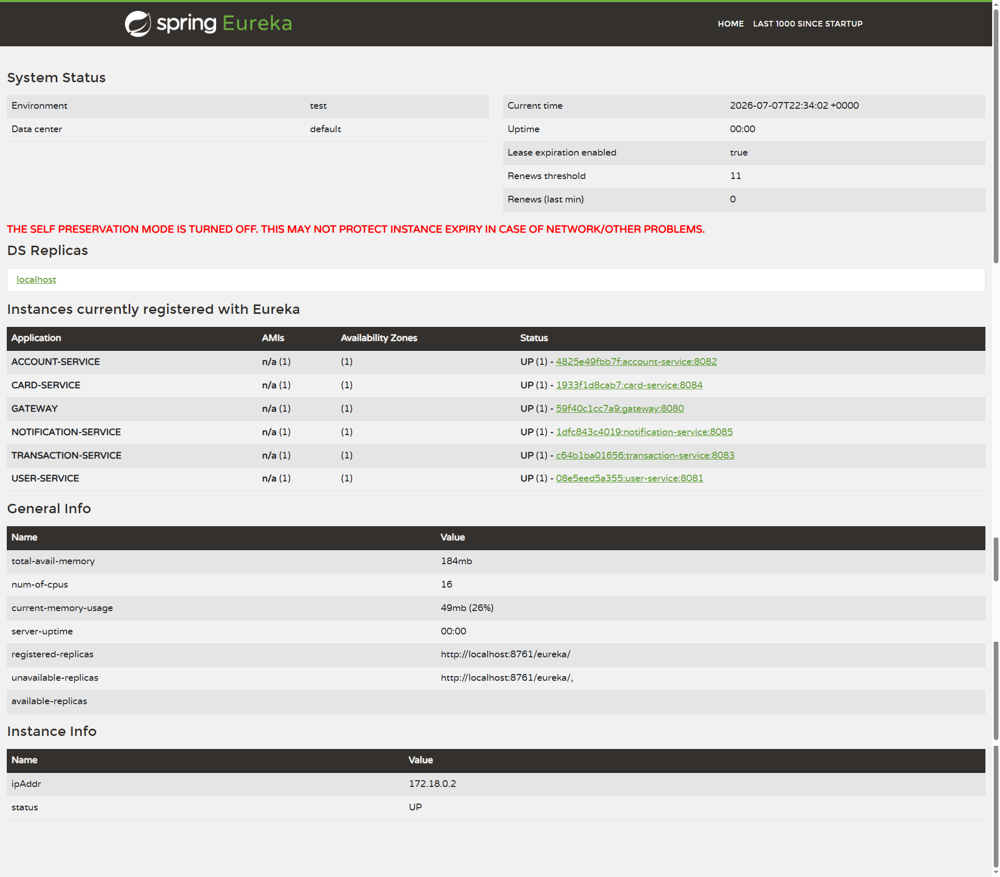
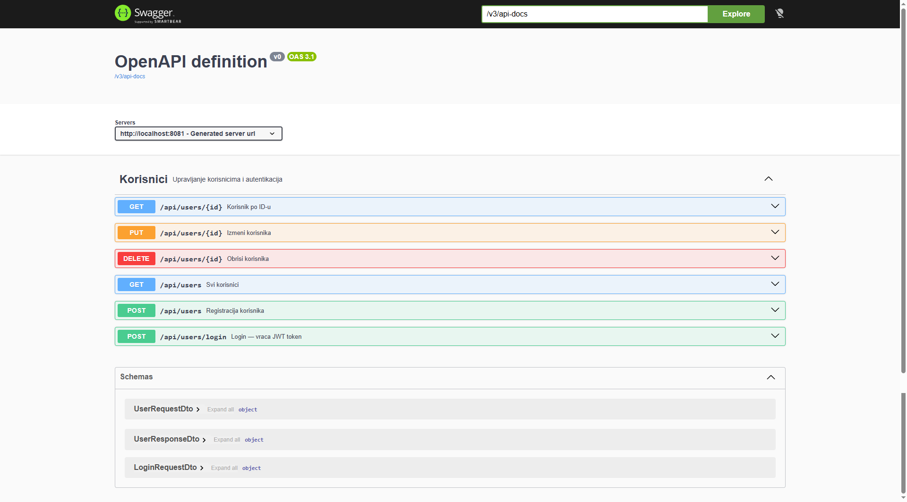
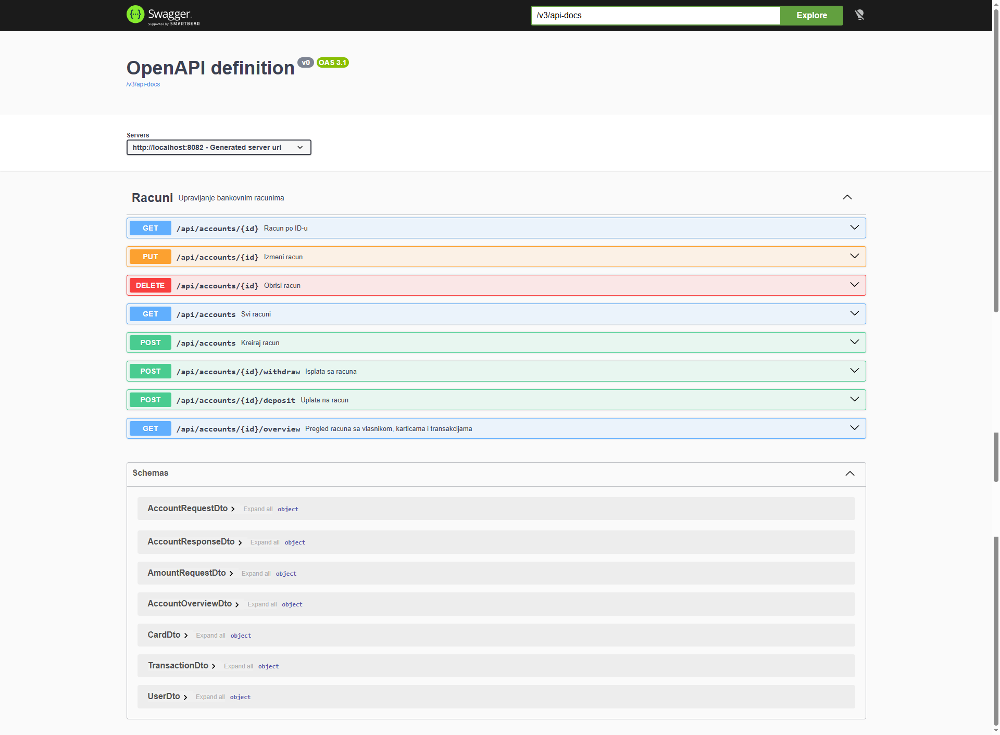
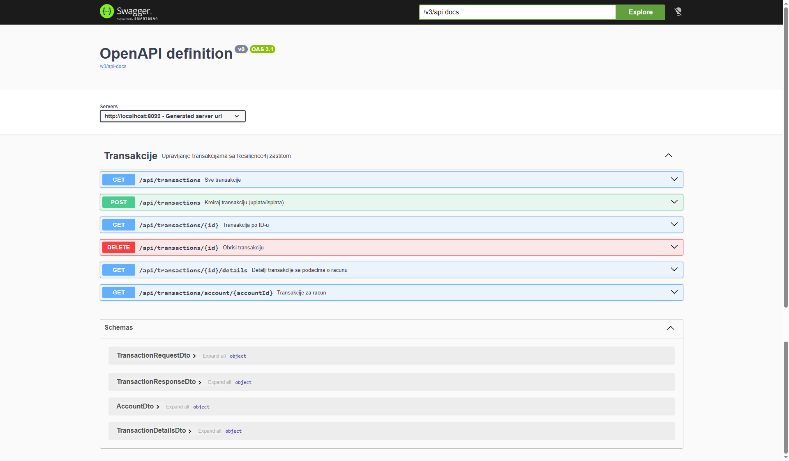
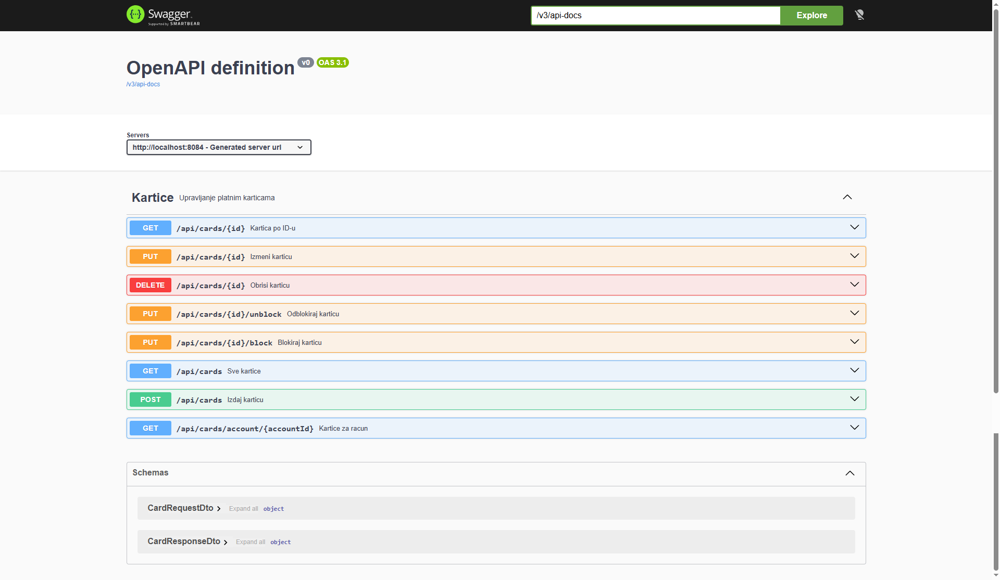
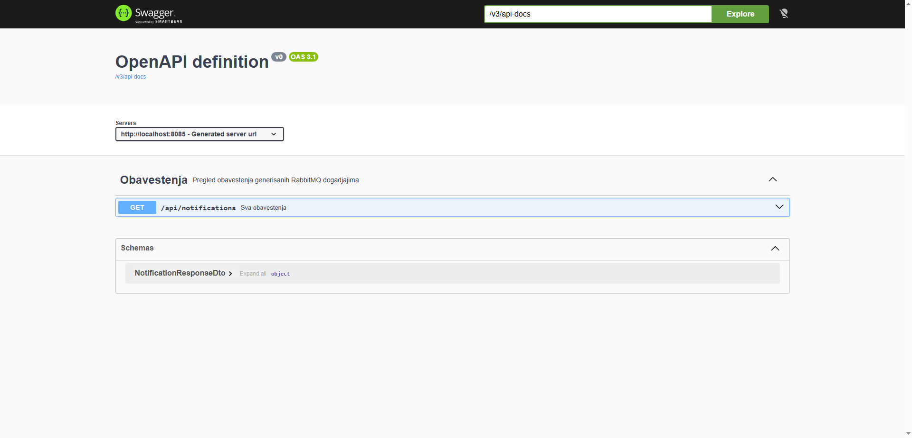

# Mini Banking — PDS Projekat

## Opis projekta

Mikroservisna aplikacija koja simulira osnovne funkcionalnosti bankarskog sistema. Sistem je podeljen na nezavisne servise koji međusobno komuniciraju kroz sinhroну (Feign) i asinhroну (RabbitMQ) komunikaciju, uz centralizovano upravljanje konfiguracijom, JWT autentifikaciju i zaštitu od grešaka.

Svaki servis ima svoju H2 in-memory bazu, izložen Swagger UI i registrovan je na Eureka serveru. Sav saobraćaj prolazi kroz API Gateway koji vrši proveru JWT tokena.

## Izabrana tema

**Mini Banking** — Account, Transaction, Card, User, Notification

| Servis | Port (lokalno) | Port (Docker) | Uloga |
|---|---|---|---|
| eureka-server | 8761 | 8761 | Registar svih servisa |
| config-server | 8888 | 8888 | Centralizovana konfiguracija |
| gateway | 8080 | 8080 | Ulazna tačka, JWT provera, rutiranje |
| user-service | 8081 | 8081 | Korisnici i autentifikacija |
| account-service | 8082 | 8082 | Bankovni računi |
| transaction-service | 8083 | 8091 / 8092 | Transakcije, Resilience4j, RabbitMQ |
| card-service | 8084 | 8084 | Platne kartice |
| notification-service | 8085 | 8085 | Obaveštenja (RabbitMQ consumer) |
| RabbitMQ | 5672 / 15672 | 5672 / 15672 | Message broker |

## Kako se pokreće

### Opcija 1 — Docker Compose (preporučeno)

**Preduslovi:** Docker, Docker Compose

**Korak 1** — Build JAR-ova za sve servise u IntelliJ-u:

Za svaki servis: Maven panel → Lifecycle → `package`

Servisi koje treba buildovati:
- eureka-server
- config-server
- user-service
- account-service
- transaction-service
- card-service
- notification-service
- gateway

**Korak 2** — Pokretanje:
```
docker-compose up --build
```

**Korak 3 (opciono)** — Sa dve instance transaction-service (load balancing):
```
docker-compose up --build --scale transaction-service=2
```

**Zaustavljanje:**
```
docker-compose down
```

### Opcija 2 — Lokalno (IntelliJ)

**Preduslovi:** JDK 17+, IntelliJ IDEA, Docker (samo za RabbitMQ)

**Korak 1** — Pokrenuti RabbitMQ:
```
docker run -d --name rabbitmq -p 5672:5672 -p 15672:15672 rabbitmq:3-management
```

**Korak 2** — Pokrenuti servise ovim redosledom u IntelliJ-u (sačekati da svaki startuje):

1. eureka-server → port **8761**
2. config-server → port **8888**
3. user-service → port **8081**
4. account-service → port **8082**
5. transaction-service → port **8083**
6. card-service → port **8084**
7. notification-service → port **8085**
8. gateway → port **8080**

**Korak 3** — Sačekati 10–15 sekundi da se svi servisi registruju na Eureci.

### Provera da sve radi

- Eureka Dashboard: http://localhost:8761 — treba biti vidljivo 6 servisa
- RabbitMQ Management: http://localhost:15672 (guest / guest)
- Config Server: http://localhost:8888/transaction-service/default

### Swagger UI po servisima

| Servis | URL (lokalno) | URL (Docker) |
|---|---|---|
| user-service | http://localhost:8081/swagger-ui.html | http://localhost:8081/swagger-ui.html |
| account-service | http://localhost:8082/swagger-ui.html | http://localhost:8082/swagger-ui.html |
| transaction-service | http://localhost:8083/swagger-ui.html | http://localhost:8091/swagger-ui.html |
| card-service | http://localhost:8084/swagger-ui.html | http://localhost:8084/swagger-ui.html |
| notification-service | http://localhost:8085/swagger-ui.html | http://localhost:8085/swagger-ui.html |

### Primer toka testiranja

```
# 1. Registracija korisnika
POST http://localhost:8080/api/users
{"ime":"Lazar","prezime":"Ivanovic","email":"lazar@primer.com","telefon":"0641234567","username":"lazar","password":"tajna123"}

# 2. Login — vraća JWT token
POST http://localhost:8080/api/users/login
{"username":"lazar","password":"tajna123"}

# 3. Kreiranje računa (Authorization: Bearer <token>)
POST http://localhost:8080/api/accounts
{"userId":1,"vrstaRacuna":"TEKUCI"}

# 4. Uplata
POST http://localhost:8080/api/transactions
{"accountId":1,"tipTransakcije":"UPLATA","iznos":5000}

# 5. Izdavanje kartice
POST http://localhost:8080/api/cards
{"accountId":1,"tipKartice":"DEBITNA","limit":50000}

# 6. Pregled računa — agregacija iz 3 servisa
GET http://localhost:8080/api/accounts/1/overview

# 7. Provera obaveštenja — generisanih RabbitMQ-om
GET http://localhost:8080/api/notifications
```

Javne rute (bez tokena): `POST /api/users`, `POST /api/users/login`

Sve ostale rute zahtevaju `Authorization: Bearer <token>` header.

## Izabrane opcije

Implementirane su sve 4 opcione tehnologije:

**A — Spring Cloud Config Server**
Centralizovana konfiguracija sa lokalnim fajl sistemom (native profil). Maksimalni iznos transakcije (`transaction.max-iznos`) čita se iz Config Servera umesto iz lokalnog `application.properties`.

**B — RabbitMQ (asinhroni događaj)**
Nakon uspešne transakcije, `transaction-service` šalje `TransactionEventDto` na `transaction.exchange`. `notification-service` konzumira poruke i kreira obaveštenje. Implementirana idempotentnost na consumer strani (provera `eventId`).

**C — Docker Compose**
`docker-compose.yml` podiže ceo sistem jednom komandom uključujući RabbitMQ. Svaki servis ima svoj `Dockerfile`. Podržano skaliranje transaction-service na 2 instance.

**D — JWT autentifikacija na Gateway-u**
`user-service` generiše JWT token pri prijavi. Gateway filtrira sve zahteve — proverava potpis tokena i prosleđuje samo validne zahteve servisima.

## Screenshoti

### Eureka Dashboard



### Swagger UI

**Korisnici (user-service)**


**Računi (account-service)**


**Transakcije (transaction-service)**


**Kartice (card-service)**


**Obaveštenja (notification-service)**
